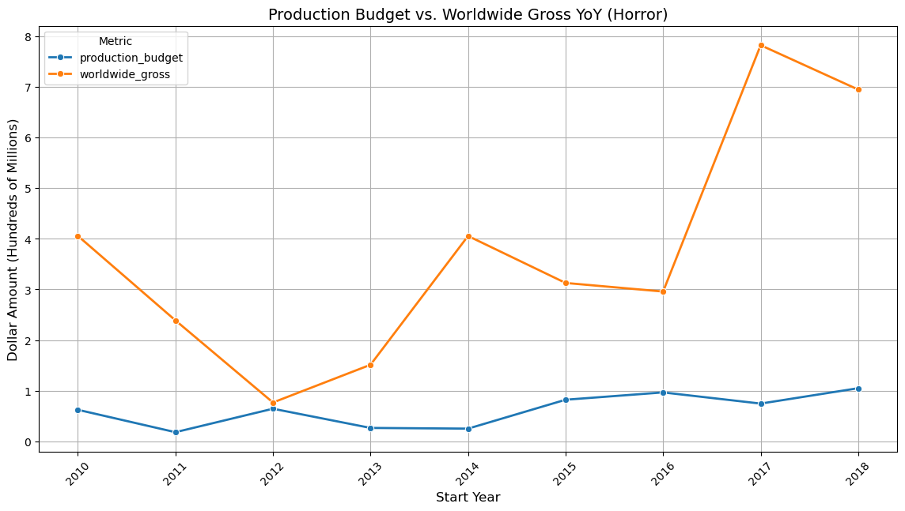
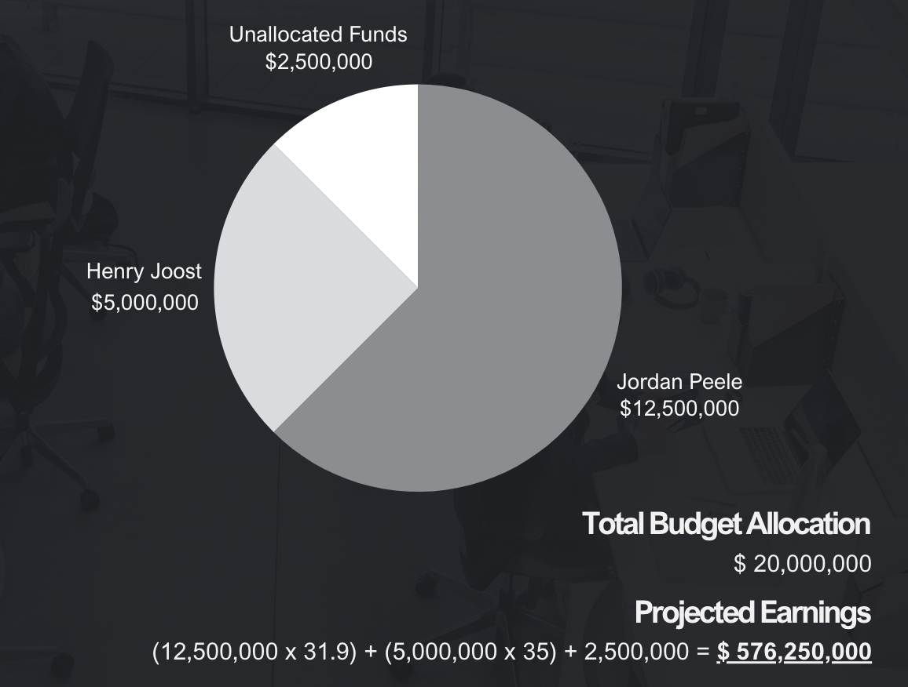

# Project Overview

This proposal is a data-driven analysis aimed at identifying the most successful movie genre and director combination. By analyzing key market trends such as genre popularity, director affordability, and critical acclaim, this proposal seeks to optimize the production budget of $20 million. Our analysis focuses on post-2010 US-based productions, examining various genres, directors, and ratings to make data-driven recommendations.

## Problem Statement

Our company is expanding into movie production and we utilized data to determine which type of movie would be the most successful given a $20 million production budget. To make an informed decision, we analyze the following aspects:
- **Genre popularity and cost-effectiveness**
- **Affordability of directors**
- **Critical acclaim of directors**

## Focus Areas

- **Budget**: $20 million
- **Focus**: US productions, post-2010 release date, genre, director, ratings

## Data and Methodology

Our proposal utilizes data on production budgets, worldwide gross revenue, and return on investment (ROI) for various genres and directors. We also analyze director ratings to understand their marketability and historical success.

### Key Analysis Areas
- **Genres**: Identifying cost-effective genres with high ROI potential.
- **Directors**: Analyzing director performance based on financial success and ratings.
- **Cost Comparison**: Examining the average production cost by genre.
- **ROI Comparison**: Evaluating the return on investment for each genre and director.
- **Director Ratings**: Assessing director's historical ratings to determine their impact on movie success.

## Key Findings

1. **Genre**: Horror is the most suitable genre for our $20 million budget. It offers the highest ROI and has been steadily popular over the years. 
   
2. **Director Recommendations**:
   - **Jordan Peele**: Known for his critically acclaimed films Get Out and Us, Peele has strong ratings and name recognition, with an average production budget of $12.5 million.
   - **Henry Joost**: Known for his work in the Paranormal Activity franchise. With an average budget of $5 million, Joost provides a cost-effective option, delivering high returns at a lower investment.
   
3. **Projected Earnings**: 
   - With a combined budget of $20 million allocated to Jordan Peele and Henry Joost, the projected earnings are approximately $576.25 million.
    
  
## Conclusion

The analysis suggests focusing on the **Horror** genre, particularly leveraging the directorial talents of **Jordan Peele** and **Henry Joost**, as they provide the best mix of cost-effectiveness, critical acclaim, and ROI potential. This strategy should ensure both financial success and critical recognition within the set budget.
